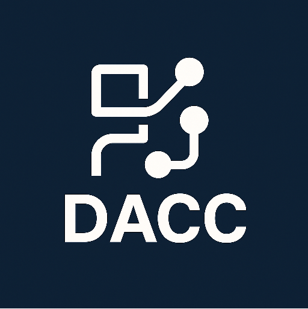

# &#x20;DACC Deterministic Agent Construction Contract

# 

**DACC** is a cutting-edge project designed to provide a deterministic, structured framework for building and managing agents, classes, methods, and runtime environments. It aims to simplify the flow of construction and enhance code clarity for developers and AI agents alike.

---

## Features

- Canonical structure for Namespaces, Types, Classes, Fields, Properties, Methods, Interfaces, and Containers.
- Deterministic runtime behavior for AI agents.
- Modular and extendable design using supporting libraries.
- Minimal but precise specification to guide agent construction and execution.

---

## Installation

```bash
# Clone the repository
git clone https://github.com/Trinity4D/DACC.git

# Navigate to the project folder
cd DACC

# (Optional) Install dependencies if needed
```

---

## Internals

Brief overview of the internal structures

```csharp
namespace DACC.Runtime

//The Built in CoPilot Agent
class CoPilot {  
  
  //Singleton Instance
  public static CoPilot Instance ()=> this;

  // CoPilot Native Prompt Abstraction
  public object Prompt(string prompt);
}

//The Container is a locator for lib files located in [./libs/*.md]
class Container { 
  static Dictionary<string, object> _registry = new();
  
  static string _ext = ".md";
  static string[] _libFiles = new[];

  //runs when this specification document is loaded
  static Container(){
      // lib files located in [./libs/*.md]
      _libFiles = File.GetList(Root);
  }
  public static string Root ()=> "./libs/";

  //Singleton Instance
  public static Container Instance ()=> this;
  
  // Read in any lib *.md file only once. **singleton**
  public object GetService(string name)
  {
    if(!_registry.ContainsKey(name))
    {
      _registry.Add(name, File.Open(Root + name + _ext));
    }

    return _registry[name];
  }
}
class Compiler {  
  
  // Compiles a User Prompt and returns each element in code block format
  public object Compile(string prompt)
  {
      // Get's all lib files and select only name into array and join the string
      var libs = String.Join(",", File.GetList().Select(p=> p.FullPath));

      //inject libs into string
      var question = "libs: {libs} ibjected here";

      //ask CoPilot the question
      var libAnswer = CoPilot.Instance.Prompt(question);
      
      // Read in all libs **into context**
      File.ReadAll(libAnswer);

      var seed = "Please Invoke Each ";

      var coPilotOutput = CoPilot.Instance.Prompt(prompt);
      return coPilotOutput;
  }
}

class File {  

  // Read a single file into context
  public static string Read(string path);
  
  // Read all files into context
  public static string ReadAll(string root, string wildcard);

   // Returns a array of 'full path of file' names
  public static string[] GetList(string path);
}
class Directory {  
  // Returns a array of 'full path of directory' names
  public static string[] GetList(string path);
}
```

## Usage

Provide a brief example of how to use DACC in code:

```csharp
// Example usage
using DACC.Runtime;

var compiler = new Compiler();
compiler.Compile("Your prompt here");
```

---

## Contributing

We welcome contributions! Please follow these steps:

1. Fork the repository.
2. Create a feature branch: `git checkout -b feature/my-feature`
3. Commit your changes: `git commit -m 'Add some feature'`
4. Push to the branch: `git push origin feature/my-feature`
5. Open a Pull Request

---

## License

This project is licensed under the **MIT License**. See the [LICENSE](LICENSE) file for details.

---

## Contact

For questions or support, contact **Zack Evans** at [[z.evans@caprisoft.co.za](mailto\:z.evans@caprisoft.co.za)].

